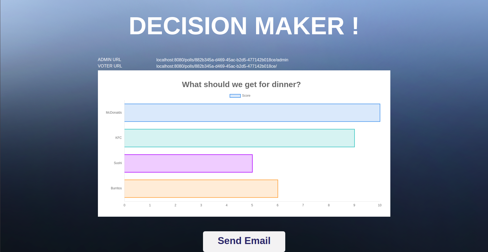

## DECISION MAKER

Poll generating web application using the Borda Count algorithm to determine rankings. Built with Node, Express, PostgresSQL, jQuery.

Users can create new polls or vote on existing ones. Poll creators recieve email updates via Mailgun. Results are displayed graphically on the poll's admin page.   

### Screenshots




### Usage

1. ```git clone <new folder>```
2. ```npm i``` 
3. Within psql environment: ```create database <db name> owner <user>;```
4. Create a .env in the root folder and add the following:
```
DB_HOST=<host>
DB_USER=<user>
DB_PASS=<pass>
DB_NAME=<db name>
DB_SSL=true if heroku
DB_PORT=5432
API_KEY=<mailgun key>
DOMAIN=<mailgun domain>
```
6. ```knex migrate:latest```
7. ```npm start```
8. ```xdg-open http://localhost:8080```

### Dependencies

* body-parser
* chart.js
* cookie-session
* dotenv
* ejs
* express
* knex
* knex-logger
* mailgun-js
* morgan
* node-sass-middleware
* pg
* uuidv4

